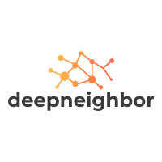

# DeepNeighbor
<p align="center">
  
</p>

[](https://pypi.org/project/deepneighbor)
[](https://pypi.org/project/deepneighbor)
[](https://github.com/LouisBIGDATA/deepneighbor)

[](https://pepy.tech/project/deepneighbor)
---

DeepNeighbor is a **High-level**,**Flexible** and **Extendible** package for embedding-based information retrieval from user-item interaction logs. Just as the name suggested, **'deep'** means deep learning models to get user/item embeddings, while **'neighbor'** means approximate nearest neighbor search in the embedding space.<br>
It mainly has two parts : Embed step and Search step by the following codes:<br>
<br>`model.train()`，which generates embeddings for users and items (Deep),
<br> `model.search()`, which looks for Approximate nearest neighbor for seed user/item (Neighbor) .
<br>

### Install
```python
pip install deepneighbor
```
### How To Use

```python
from deepneighbor.embed import Embed

model = Embed(data)
model.train()
model.search(seed = 'Louis', k=10)
```
### Input format
The input data for the **Embed()** should be a pandas DataFrame with two columns in order: 'user' and 'item'. For each user, the item are recommended to be ordered by time.
### Models
- [x]  word2vec
- [ ] Siamese Network with triple loss
- [ ]  deepwalk
- [x]  graph convolutional network
- [ ]  matrix factorization
- [ ]  graph attention network

### Examples
TBD

### License
